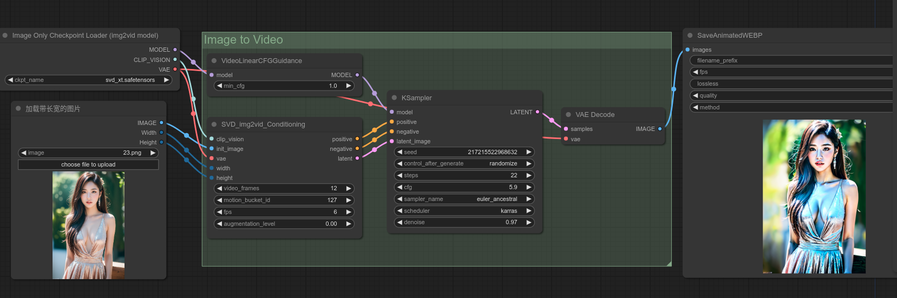

# ComfyUI-tools-diy
自定义的comfyui的插件

当前只有一个功能,加载图片时同时输出图片的长宽参数,方便stable_video_diffusion模型生成动画,不需要每次切换图片时,都需要重新输入图片的长和宽的参数


## 安装插件
```
cd ComfyUI/custom_nodes
git clone https://github.com/gaodianzhuo/ComfyUI-tools-diy.git
```

## 使用效果

